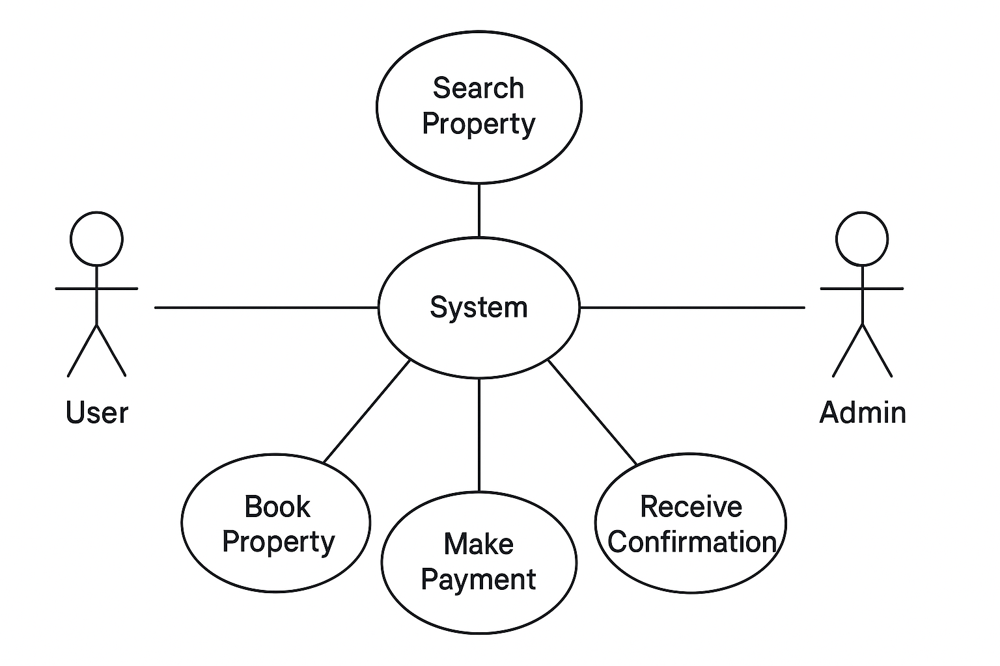

Requirement Analysis in Software Development
Introduction

This repository explains the concept, importance, and key activities of Requirement Analysis in the Software Development Life Cycle (SDLC).
Requirement Analysis helps identify user needs and system expectations before the coding phase begins, ensuring the final product aligns with business goals.

What is Requirement Analysis?

Requirement Analysis is the process of gathering, analyzing, and documenting user requirements to ensure that the software product meets the needs of all stakeholders.
It serves as a foundation for design, development, and testing activities within the SDLC.
Through requirement analysis, teams identify what the software should do and how it should behave.

Importance:

Prevents misunderstandings between clients and developers

Reduces costly changes during development

Ensures the final product aligns with user expectations

Why is Requirement Analysis Important?

Clarity and Communication: It bridges the gap between stakeholders and developers.

Prevents Scope Creep: Clearly defined requirements prevent uncontrolled project expansion.

Improves Quality: Ensures that the system meets user needs effectively and efficiently.

Key Activities in Requirement Analysis

Requirement Gathering: Collecting needs and expectations through interviews, surveys, and observation.

Requirement Elicitation: Refining and clarifying gathered requirements using brainstorming, prototyping, and focus groups.

Requirement Documentation: Creating structured documents like Software Requirement Specification (SRS).

Requirement Analysis and Modeling: Analyzing relationships, dependencies, and modeling requirements using tools like UML.

Requirement Validation: Reviewing and verifying requirements with stakeholders to ensure accuracy and completeness.

Types of Requirements
Functional Requirements

These define what the system should do.
They describe specific functionalities and features of the system.

Examples (for a booking management system):

Users can register, log in, and log out.

Users can search and book properties.

The system sends booking confirmation emails.
Non-functional Requirements

These describe how the system performs its functions.
They include performance, usability, security, and scalability.

Examples:

Pages should load within 2 seconds.

The system should support up to 10,000 users simultaneously.

User data must be encrypted for security.
Use Case Diagrams

Definition:
A Use Case Diagram visually represents how users (actors) interact with the system.
It helps identify key functionalities and the relationships between users and system processes.

Benefits:

Provides a clear visual overview of system interactions

Simplifies communication between stakeholders and developers

Helps identify potential missing functionalities

Acceptance Criteria

Definition:
Acceptance Criteria are the conditions that a software feature must satisfy to be accepted by stakeholders.
They define clear boundaries and expectations for feature completion.

Importance:

Ensures all stakeholders agree on what success looks like

Provides measurable goals for developers and testers

Prevents miscommunication on feature scope

Example (Checkout Feature in Booking System):

The user must be able to select a property and proceed to payment.

The system must validate payment details and display a success message.

A confirmation email must be sent automatically after payment.
